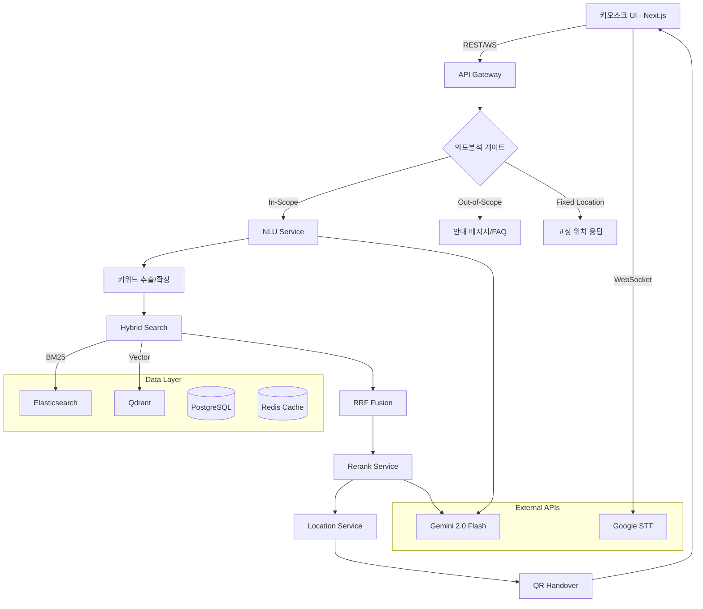

# 다이소 상품 위치 안내 RAG 기반 AI 검색 서비스 — 아키텍처 및 통합 계획

> **작성일**: 2026-02-10  
> **목표**: PoC 모듈 통합 → Node.js/TypeScript 기반 서비스 재구축 → TDD → AWS Lightsail 배포

---

## 1. 현재 상태 분석 (As-Is)

### 1.1 프로젝트 구조

현재 프로젝트는 **Python(FastAPI) 기반 PoC** 상태이며, 각 기능이 별도 모듈로 분리되어 있으나 **통합되지 않은 상태**입니다.

| 모듈 | 위치 | 담당 | 상태 | 기술 |
|------|------|------|------|------|
| **STT** | `poc/stt/` | STT 파이프라인 | PoC 완료 | Whisper + Google Cloud STT |
| **NLU/의도분석** | `poc/kms/` | 의도분석 + 키워드 추출/확장 | PoC 완료 | Gemini 2.0 Flash |
| **검색 엔진** | `poc/lyg/` | BM25 + Vector + Hybrid 검색 | PoC 완료 | Elasticsearch + Qdrant |
| **리랭킹** | `poc/kdg/` | LLM 기반 리랭킹 | PoC 완료 | Gemini 2.0 Flash |
| **의도분석 게이트** | `poc/intent/` | In/Out-of-scope 판별 | PoC 완료 | Gemini 2.0 Flash |
| **위치안내/QR** | `poc/bjy/` | 위치 매핑 + QR 핸드오버 | PoC 완료 | - |
| **Agent Graph** | `backend/logic/` | LangGraph 기반 워크플로우 | 부분 통합 | LangGraph + Gemini |
| **Frontend** | `frontend/` | Next.js 키오스크 UI | 기본 구현 | Next.js 14 + Tailwind |
| **DB** | `backend/database/` | SQLite + CLIP 임베딩 | PoC 완료 | SQLite + CLIP |

### 1.2 PoC 검증 결과 요약

| 단계 | 모델 | 핵심 지표 | 결과 |
|------|------|-----------|------|
| STT | Google Cloud API | Keyword Hit | 69% → 목표 90% |
| STT | Whisper medium | Keyword Hit | 80% → fallback 후보 |
| 의도분석 | Gemini 2.0 Flash | Accuracy | **97%** ✅ |
| 키워드 추출 | Gemini 2.0 Flash | Accuracy | **89%** |
| 검색 Hybrid | BM25+Vector RRF | Hit@5 | **98~99%** ✅ |
| 리랭킹 | Gemini 2.0 Flash | Accuracy | **93.4%** ✅ |
| QR 핸드오버 | - | 성공률 | **100%** ✅ |

### 1.3 Gap 분석 — 현재 vs 목표

```
현재 상태                              목표 상태
─────────────────────────────────     ─────────────────────────────────
Python PoC 모듈 분산                  → Node.js/TypeScript 모노레포 통합
SQLite 단일 DB                        → PostgreSQL + Redis + Elastic + Qdrant
테스트 없음                            → TDD 강제, Jest 80%+ 커버리지
Docker 미구성                          → Docker Compose merged/msa 프로파일
배포 없음                              → AWS Lightsail 단일 인스턴스
프론트엔드 기본 UI                     → 키오스크 전용 UI + QR + 음성
```

---

## 2. 목표 아키텍처 (To-Be)

### 2.1 시스템 흐름도



### 2.2 논리적 서비스 분해 — 물리적 통합 실행

문서 원칙에 따라 **논리적 MSA + 물리적 모놀리식 런타임**:

```
apps/
  api-gateway/          ← 단일 인바운드, 인증/레이트리밋, 라우팅
  
packages/               ← 논리적 서비스 = 내부 패키지
  stt-service/          ← 음성 스트리밍 → 텍스트, 품질 게이트
  nlu-service/          ← 의도분석 + 키워드 추출/확장
  retrieval-service/    ← BM25 + Vector + Fusion
  rerank-service/       ← 후보 재정렬, Top1 확정
  location-service/     ← 상품/카테고리 → 매장 위치 매핑
  handover-service/     ← QR 생성, 모바일 인계 세션
  shared-types/         ← DTO, zod schema, error codes
  shared-utils/         ← logger, config, tracing
  test-helpers/         ← fixtures, mocks, factories
```

**merged 모드**: `api-gateway` 1개 프로세스가 모든 패키지를 in-process import  
**msa 모드**: 각 패키지가 독립 HTTP 서비스로 실행 — 확장/성능 테스트용

### 2.3 어댑터 패턴 — 실행 모드 전환

```typescript
// packages/retrieval-service/client.ts
interface RetrievalClient {
  search: query => Promise<SearchResult[]>
}

// merged 모드: in-process 호출
class InProcessRetrievalClient implements RetrievalClient { ... }

// msa 모드: HTTP 호출
class HttpRetrievalClient implements RetrievalClient { ... }
```

---

## 3. 기술 스택 확정

| 레이어 | 기술 | 비고 |
|--------|------|------|
| Runtime | Node.js + TypeScript strict | 문서 권장 |
| API Framework | Express 또는 Fastify | REST + WebSocket |
| Frontend | Next.js 14 + Tailwind | 기존 유지 |
| Test | Jest + Supertest + Nock | TDD 강제 |
| Lint/Format | ESLint + Prettier | strict mode |
| DB | PostgreSQL | 상품/카테고리/이력 |
| Cache | Redis | 세션/레이트리밋/캐시 |
| Search - BM25 | Elasticsearch | 기존 PoC 검증 완료 |
| Search - Vector | Qdrant | 기존 PoC 검증 완료 |
| STT | Google Cloud STT Streaming | 1차 엔진 |
| STT Fallback | Whisper medium | 2차 엔진 |
| LLM | Gemini 2.0 Flash | 의도분석/키워드/리랭킹 |
| Embedding | paraphrase-multilingual-MiniLM-L12-v2 | PoC 검증 완료 |
| Container | Docker Compose | merged/msa 프로파일 |
| Deploy | AWS Lightsail Instance | Nginx + Docker Compose |
| Monorepo | npm workspaces 또는 turborepo | 패키지 관리 |

---

## 4. 마일스톤 및 실행 계획 (프로젝트 문서 기준)

> 문서 원본 마일스톤 순서를 따르되, 각 단계를 세부 태스크로 분해합니다.

### M0: 병합/통합 실행 안정화

> 기능별 PoC 구현을 병합하고, 통합 실행 환경을 구축합니다.

**M0-1: 프로젝트 초기화 및 모노레포 구성**
- [ ] Node.js/TypeScript 모노레포 scaffolding (npm workspaces)
- [ ] `packages/shared-types`: Zod 스키마 정의 — API 계약 고정
- [ ] `packages/shared-utils`: logger, config loader, error handler
- [ ] `packages/test-helpers`: fixtures, mock factories
- [ ] ESLint + Prettier + TypeScript strict 설정
- [ ] Jest 테스트 환경 구성

**M0-2: 핵심 서비스 구현 — TDD**
- [ ] `packages/stt-service`: Google STT Streaming 어댑터 + Quality Gate + Policy Gate
- [ ] `packages/nlu-service`: Gemini 기반 의도분석 + 키워드 추출/확장
- [ ] `packages/retrieval-service`: Elasticsearch BM25 + Qdrant Vector + RRF Fusion
- [ ] `packages/rerank-service`: Gemini 기반 리랭킹
- [ ] `packages/location-service`: 카테고리 → 매장 위치 매핑
- [ ] `packages/handover-service`: QR 생성 + 모바일 세션

**M0-3: API Gateway + 통합 실행**
- [ ] `apps/api-gateway`: Express/Fastify + 라우팅 + 레이트리밋
- [ ] merged 모드 in-process 어댑터 연결
- [ ] `POST /v1/search` 엔드포인트 구현
- [ ] WebSocket `/ws/stt` 엔드포인트 구현
- [ ] Docker Compose merged 프로파일 구성 (앱 1개 + Elastic/Qdrant/Redis/PostgreSQL)
- [ ] 통합 테스트 — 최소 e2e 3케이스 Green (욕실매트/건전지/잡음발화)
- [ ] 병합 모드 프로세스 수 검증: 애플리케이션 런타임 1~3개

**M0-4: Frontend 키오스크 UI**
- [ ] 키오스크 전용 UI 리디자인
- [ ] 음성 입력 WebSocket 연동
- [ ] Top3 결과 카드 + Top1 강조
- [ ] QR 코드 표시 + 모바일 핸드오버
- [ ] 타이밍 정보 표시

### M1: 하이브리드 검색 지표 고정

- [ ] hit@k / mrr / ndcg 자동 측정 스크립트 구현
- [ ] 매 릴리즈마다 비교 가능한 벤치마크 템플릿화
- [ ] 검색 파라미터 최적화 (K=30 확정, fusion weight 튜닝)
- [ ] 테스트케이스 확장 (CLEAN + NOISY)

### M2: 리랭킹/애매함 처리 고도화

- [ ] 애매함 판정 로직 강화
- [ ] 꼬리질문 (Drill-Down) 고도화
- [ ] 2회 실패 시 Fallback 처리
- [ ] 리랭킹 프롬프트 최적화

### M3: Lightsail 운영 안정화

- [ ] Nginx reverse proxy 설정
- [ ] 환경변수/시크릿 관리 (Lightsail 환경변수)
- [ ] AWS Lightsail 배포 스크립트
- [ ] 로그/모니터링 구성
- [ ] 장애 Fallback (BM25-only 축소 운영)
- [ ] 비용 상한 운영
- [ ] 헬스체크 엔드포인트

---

## 5. API 계약 — 핵심 엔드포인트

### POST /v1/search

```json
// Request
{
  "storeId": "store_001",
  "inputType": "text",
  "query": "욕실 매트 어디 있어요?",
  "sessionId": "uuid"
}

// Response
{
  "requestId": "uuid",
  "isInScope": true,
  "top3": [
    { "productId": "bath_mat", "name": "욕실 매트", "locationText": "2층 욕실/청소 코너", "score": 0.93 }
  ],
  "top1Handover": {
    "qrPayload": "https://.../handover/...",
    "expiresInSec": 120
  },
  "timingMs": {
    "intent": 120,
    "extract": 180,
    "retrieve": 320,
    "rerank": 600,
    "total": 1220
  }
}
```

### WebSocket /ws/stt

- `start` → STT 세션 시작
- `audio` → PCM base64 청크 전송
- `interim` ← 중간 결과
- `final` ← 최종 결과 + 자동 검색 트리거
- `stop` → 세션 종료

---

## 6. TDD 워크플로우

모든 구현은 반드시 다음 순서를 따릅니다:

1. **테스트 코드 작성** — 성공 기준을 코드로 고정
2. **테스트 실행 → 실패 확인** — Red
3. **최소 구현** — Green
4. **전체 테스트 재실행 → 통과 확인**
5. **리팩토링** — 모듈화/중복 제거
6. **회귀 테스트 재실행** — 항상 Green 유지

### 작업 지시 템플릿

```
목표: (한 줄로)
성공기준: (Jest 테스트가 Red→Green, 테스트 수정 금지)
범위: (수정 가능한 폴더/파일)
금지: 구현 먼저 작성 금지. 반드시 테스트 → 실패 확인 → 구현.
명령: (실행할 테스트/빌드 명령)
```

---

## 7. Docker Compose 프로파일

```yaml
# merged 프로파일: 로컬 개발/테스트 기본
# 애플리케이션 런타임 1개 + 인프라 4개 = 총 5 컨테이너
services:
  app:           # api-gateway + 모든 서비스 통합
  elasticsearch: # BM25 검색
  qdrant:        # Vector 검색
  redis:         # 캐시/세션
  postgres:      # 메인 DB
```

---

## 8. 데이터 마이그레이션 계획

현재 SQLite `products.db`의 데이터를 PostgreSQL로 마이그레이션:

1. 상품 테이블 → PostgreSQL `products`
2. 카테고리 테이블 → PostgreSQL `categories`
3. 임베딩 → Qdrant 컬렉션으로 이관
4. 상품 텍스트 → Elasticsearch 인덱스로 이관
5. 테스트 발화 → PostgreSQL `test_utterances`
